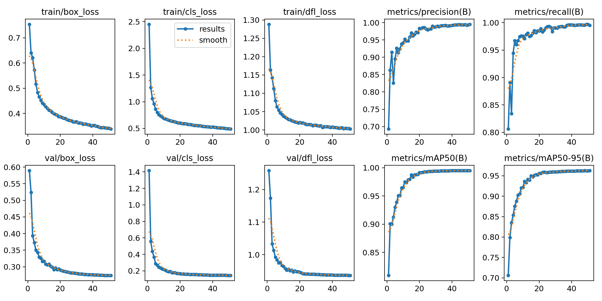

# YOLOv8-TrafficSign-CBAM
基于 YOLOv8 的实时交通标志检测，引入 CBAM 注意力机制提升小目标检测精度

## 🛠️ 环境配置

- OS: Ubuntu 22.04 LTS
- Python: 3.10
- Conda 环境: `yolo`
- 核心依赖:
  - torch
  - ultralytics
  - opencv-python
  - pandas
  - scikit-learn

## 📊 数据集

- **名称**: GTSRB (German Traffic Sign Recognition Benchmark)
- **类别数**: 43
- **训练集**: 31,367 张（8:2 划分）
- **验证集**: 7,842 张
- **数据格式**: YOLO（转换脚本 `final_convert.py`）
- **数据修复记录**: 原始 GTSRB 不同类别文件夹下图片同名（如 `00000_00000.ppm`），旧脚本只取 basename 导致覆盖，images/train 仅 2238 张。修复方案：文件名加类别前缀 `f"{class_folder}_{base_name}.jpg"`，标签用 "w" 覆盖写，int(row['ClassId']) 直接映射（0~42）。

## 🧪 实验记录

### Exp-01: YOLOv8n Baseline（失败，数据 bug）

| 项目 | 设置 |
|------|------|
| 模型 | YOLOv8n (yolov8n.pt) |
| 输入尺寸 | 640 × 640 |
| Batch Size | 8 |
| Epochs | 50 |
| 设备 | RTX 3050 Laptop 4GB |

**结果**：mAP50 = 0.172（无效）

**原因分析**：
- 数据转换脚本 bug 导致训练集仅 2238 张（应为 31367 张），图片被后写覆盖
- 标签与图片不匹配，模型无法有效学习
- 结论：此结果作废，修复数据 pipeline 后重训

---

### Exp-02: YOLOv8n Baseline（修复后，有效）

| 项目 | 设置 |
|------|------|
| 模型 | YOLOv8n (yolov8n.pt) |
| 输入尺寸 | 640 × 640 |
| Batch Size | 8 |
| Epochs | 51（因内存问题中断，已充分收敛） |
| 设备 | RTX 3050 Laptop 4GB |

**训练结果**：

| 指标 | 数值 |
|------|------|
| mAP50 | **0.990** |
| mAP50-95 | **0.960** |
| Precision | **0.990** |
| Recall | **0.985** |

**分析**：
- ✅ 模型快速收敛，Loss 平稳下降，无过拟合
- ✅ GTSRB 43 类检测任务达到预期水平
- 训练曲线：

---

### Exp-03: YOLOv8n + CBAM（待进行）

- 状态: 🔜 待执行
- 计划: 在 Backbone/Neck 中嵌入 CBAM 注意力模块
- 预期: 提升小目标（远处交通标志）的召回率和 mAP
- 对比基准: Exp-02 (mAP50=0.990)

## 📝 待办事项

- [x] 排查 Exp-01 数据问题，修复转换脚本
- [x] 重新训练 Baseline，确认 mAP50 > 0.95
- [ ] 实现 CBAM 模块并注册到本地 ultralytics
- [ ] 运行 Exp-03，对比 Baseline vs CBAM
- [ ] 分析混淆矩阵，撰写实验报告

